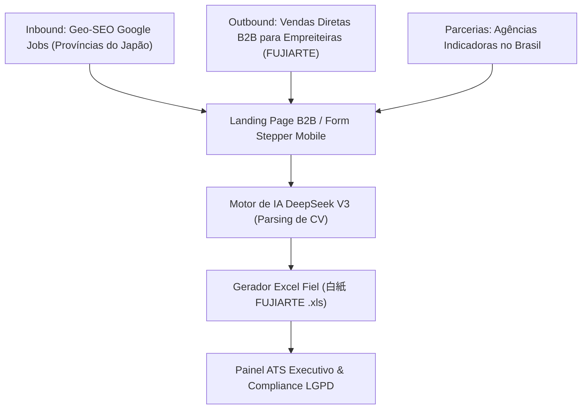

# Plano de Marketing, Vendas B2B & Go-To-Market — SelectSys Jobs V2

---

## Executive Summary & Value Proposition

**SelectSys Jobs V2** é a primeira plataforma SaaS enterprise especializada na automação e digitalização do pipeline de recrutamento **Dekassegui (Brasil ➔ Japão)**.

### A Dor do Mercado (Caso FUJIARTE)
Atualmente, agências e empreiteiras gastam **15 a 20 dias** para processar a Ficha Cadastral tradicional em papel/Excel, resultando em:
* Erros manuais na digitação de biometria de EPIs (tamanho de calçado 24.5 - 28.0 cm, cintura).
* Rejeições de vistos COE pela imigração japonesa por inconformidades em histórico profissional.
* Custos elevados com digitação e perda de candidatos qualificados para concorrentes.

### A Solução Comercial
Com o **SelectSys Jobs V2**, a candidatura é concluída em **7 a 10 minutos** via celular com auxílio de **IA DeepSeek V3**, gerando a planilha **100% fiel no layout da FUJIARTE (`白紙 FUJIARTE Ficha Cadastral.xls`)**.

---

## 1. Perfil do Cliente Ideal (ICP) & Segmentação

| Segmento | Alvo Principal | Valor Entregue |
| :--- | :--- | :--- |
| **Empreiteiras Tier 1 (Japão)** | FUJIARTE Co., Ltd., World Intec, Sunext | Redução de 60-70% no tempo de emissão de COE e zero retrabalho em Excel |
| **Agências Indicadoras (Brasil)** | Agências em SP, PR, SC, MS, PA | Portal exclusivo para submissão com rastreamento de comissão por lead enviado |
| **Candidatos Dekassegui** | Nikkeis (Nissei, Sansei, Yonsei) e Cônjuges | Cadastro simples via celular em 5 etapas com auto-preenchimento por IA |

---

## 2. Estratégia de Captação e Canais de Marketing (GTM)

### Canal 1: Geo-SEO & Google Jobs Brasil/Japão
* Indexação de páginas dedicadas por província japonesa (Ex: `SelectSys Jobs Aichi`, `Vagas Toyota Shizuoka`).
* Utilização do formato Schema.org `JobPosting` em JSON-LD para figurar no topo do Google Jobs sem custos com tráfego pago.

### Canal 2: Apresentação Executiva Direta (Pitch FUJIARTE)
* Demonstração ao vivo do **Simulador .XLS** homologado com a Ficha de Junho/2024 da FUJIARTE.
* Apresentação da Calculadora de ROI demonstrando economia direta de OpEx de IA (DeepSeek V3 vs Claude).

### Canal 3: Programa de Agências Indicadoras
* Agências de recrutamento no Brasil recebem um link exclusivo (`tenant_id`) para cadastrar candidatos e acompanhar o comissionamento por candidato aprovado.

---

## 3. Matriz de Posicionamento de Marca & Mensagens Chave

* **Velocidade**: *"De 20 dias manuais para 7 minutos digitais no celular."*
* **Fidelidade Operacional**: *"Planilhas .XLS 100% no modelo nativo que os avaliadores no Japão já usam."*
* **Eficiência Financeira**: *"Inteligência Artificial de última geração (DeepSeek V3) com custo 95% menor que o Claude."*
* **Segurança Legal**: *"Total compliance com a LGPD no Brasil (Art. 5º, 11 e 20) e lei APPI no Japão."*

---

## 4. Tabela de Preços e Modelos de Monetização (SaaS B2B)

| Plano | Preço Mensal | Candidatos / Mês | Funcionalidades Incluídas |
| :--- | :--- | :--- | :--- |
| **Starter Empreiteira** | R$ 3.500 / mês | Até 100 candidatos | Form Stepper, Exportador Excel FUJIARTE, Compliance LGPD |
| **Enterprise FUJIARTE** | R$ 8.900 / mês | Até 500 candidatos | Motor IA DeepSeek ilimitado, Painel ATS Duplo, Suporte WhatsApp API |
| **Custom / SaaS White-Label** | R$ 15.000 / mês | Ilimitado | Domínio próprio, marca própria, integração via API REST |

---

## 5. Cronograma de Lançamento (Go-To-Market Timeline)

* **Segunda-Feira (Dia 1)**: Validação do Plano Master e apresentação do protótipo funcional para a diretoria da FUJIARTE.
* **Semanas 1-2**: Ajustes finos no exportador `.xls` e integração com banco de dados PostgreSQL com criptografia `pgcrypto`.
* **Semanas 3-4**: Lançamento das landing pages Geo-SEO por Província e onboarding das primeiras agências indicadoras no Brasil.
